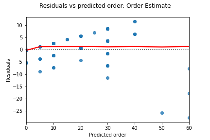

# Progress Report - June 3, 2022

# Questions

1. Do you have data fully in hand and if not, what blockers are you facing?
    - Yes, the data is fully in hand and saved in the **data** folder.
    - Data cleaning and merging of datasets has been completed in [01_data_cleaning]('code/01_data_cleaning.ipynb') notebook. Processed datasets are saved in the **cleaned_datasets** folder.
    - Some work could be done to organize/consolidate the 01 notebook and cleaned_datasets folder. This is lower priority compared to other priorities to be detailed below. I would aim to complete this towards the end of project if time allows.
2. Have you done a full EDA on all of your data?
    - EDA has been completed on data for the older models (the source of forecasting and regression modeling) - see [02_EDA]('code/02_EDA.ipynb'). However, I have not done a EDA on the new models. This a high priority for next steps. 
3. Have you begun the modeling process? How accurate are your predictions so far?
   - I have generated forecasting predictions for old models (where there are previous sales) - see [03_Forecasting_Quarterly]('code/03_Forecasting_Quarterly.ipynb') and [04_Forecasting_Monthly]('code/04_Forecasting_Monthly.ipynb'). I have explored various types of forecasting models and identified a model that minimizes the RMSE. This also happens to be the method that the business uses (rolling 6-month average). Therefore if you define a baseline model as that which the business already uses, it does not improve on this. However, I recognize the limitation in the model in that it does not include seasonality (uptick in sales towards the end of the year). A high priority for early next week is to try to improve the forecasting model and implement seasonality in an effective way.
   - For new models, I have explored various regression models to attempt to predict yearly sales based on other watch attributes and their sales - see [05_Regression_Predict_Sales]('code/05_Regression_Predict_Sales.ipynb'). The model slightly improvemes the RMSE compared to the baseline model (the mean of all the sales, which seems to be the method the business uses). I have generated some predictions using a random forest regressor as a rough model, but similar to the forecasting model, I think there is room for improvement and it is high priority to improve the model next week. Some ideas are: polynomial features, better data cleaning, removing variables, grid search, voting regressors. Another big idea is to try classification into discrete categories (i.e. 10 sales, 20 sales, 50 sales, etc), and see if that improves the predictive power of the data - this is planned to be notebook #6.
   - Using the forecasts for old models and predictions for new models, I have a notebook that attempts to combine these and generate the orders for the proposal sheet - see [07_Proposal_Order_Amounts]('code/07_Proposal_Order_Amounts.ipynb'). For the old models, I use the business's strategy of maintaining 3 months of stock on hand. The order is generated by calculating the forecast for 3 months and subtracting the units on hand. For the new models, I simply calculate the predicted sales over 3 months (I just realized I should probably implement some seasonality in this too). I then compare this against the owner's actual order amount as another validation step - see image below:
   
4. What blockers are you facing, including processing power, data acquisition, modeling difficulties, data cleaning, etc.? How can we help you overcome those challenges?
    - Modeling difficulties is the biggest blocker. I feel like I am throwing spaghetti at the wall to see what sticks, and I'm not getting great models so I am a little nervous. Perhaps suggestions of data cleaning/preprocessing/modeling techniques would be helpful to push me on a new path.
5. Have you changed topics since your lightning talk? Since you submitted your Problem Statement and EDA? If so, do you have the necessary data in hand (and the requisite EDA completed) to continue moving forward?
    - No.
6. What is your timeline for the next week and a half? What do you _have_ to get done versus what would you _like_ to get done?
    - By Saturday night: EDA of new models, and clean/EDA of new datasets
    - By Tuesday night: Finish refining models
    - By Thursday night: Clean/organize notebook, write Python script to generate predictions (if there's time), and write executive summary.
    - Friday: Start working on presentation, and make final tweaks to report based on presentation.
7. What topics do you want to discuss during your 1:1?
    - See #4, and any other areas you have suggestions/concerns

