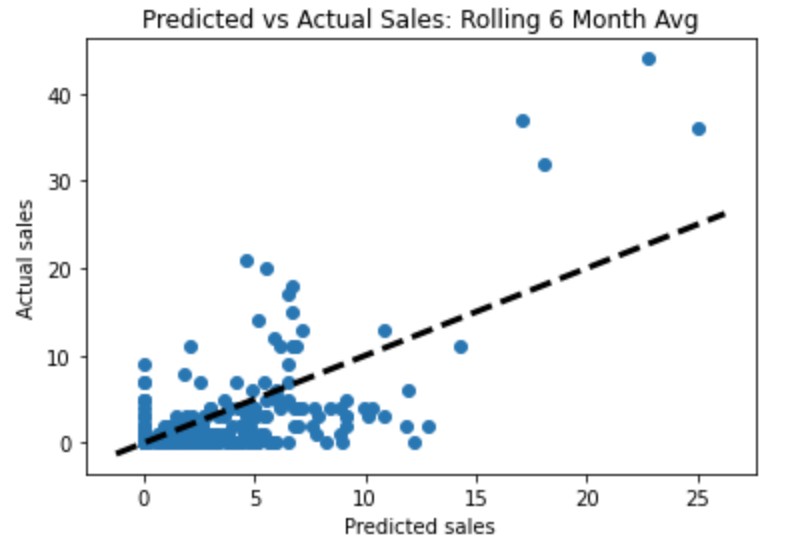
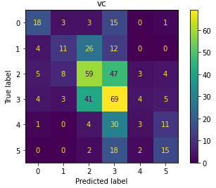
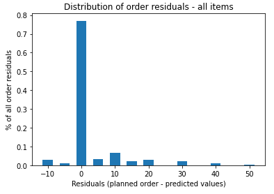
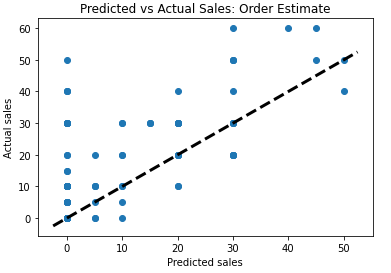

# Forecasting Quarterly Watch Sales for XYZ Company


## Executive Summary
XYZ company is an American company that distributes fashion and household items to smaller retailers in the Latin America & North American markets. Success is determined by how well XYZ manages inventory to optimize warehouse space and minimize the purchase of unsuccessful products. XYZ typically purchases directly from the brands on a quarterly basis, which they then go on to sell to the smaller retailers. They must predict how much they can sell to the smaller retailers in order to place quarterly brand orders. 

Typically, XYZ makes their predictions by calculating a 6-month rolling average and placing an order to make sure they have enough inventory for 3 months. If it is a new model, they must make a guess based on the attributes of the watch. This is a very manual process and requires the 30-year expertise of the owner to be done well. Additionally, there are many different types of products within each brand (ex. 300 different watch models for 1 brand), and there are approximately 40 brands.

In this project, I aim to build a forecasting and classification system that accurately and more quickly generates quarterly orders for both new and existing models for one watch brand. The model predicts watch sales based on historical sales, and if not available, the individual model attributes (style, gender, color, price, material, etc). Different types of models were explored to adequately and appropriately accomplish this goal (forecasting, regression, classification). The predictions were then processed to develop order quantities and produce the order_sheet.csv product. These order quantities were compared against the owner's planned order for the next quarter during a meeting in mid-June.

## Project Directory
```
capstone
|__ code
|   |__ 01_data_cleaning.ipynb
|   |__ 02_EDA.ipynb
|   |__ 03_Forecasting_Quarterly.ipynb
|   |__ 04_Forecasting_Monthly.ipynb
|   |__ 05_Regression_Predict_Sales.ipynb
|   |__ 06_Classification_Predict_Sales.ipynb
|   |__ 07_Proposal_Order_Amounts.ipynb
|   |__ custom_functions.py
|   |__ eda_custom_functions.py
|   |__ forecasting_custom_functions.py
|   |__ regression_custom_functions.py
|__ data
|   |__ cleaned_datasets
|   |__ |__ df_models.csv
|   |__ predictions
|   |__ |__ new_models_classifications.csv
|   |__ |__ new_models_regression.csv
|   |__ |__ proposal_forecast.csv
|   |__ |__ sarima_preds_monthly.csv
|   |__ |__ sarima_preds.csv
|   |__ raw_datasets
|   |__ |__ ALL ITEMS FROM WEBSITE.xlsx
|   |__ |__ ITEMS CREATED 2022H3.xlsx
|   |__ |__ Plan Order 2022H3.xlsx
|   |__ |__ PROPOSAL.xlsx
|   |__ |__ WATCH FLOW CHART.xlsx
|__ images
|   |__ Order_Estimate.png
|__ output
|   |__ order_sheet.csv
|__ presentation.pdf
|__ README.md
```

## Data Collection and Processing

The data for the project was pulled from 5 sources provided by XYZ Company, as described in the chart below:

|Source|Description|No. Samples|No. Features|
|---|---|---|---|
|WATCH FLOW CHART.xlsx|contains XYZ's records of each model's sales for the brand since 2015 (when they started distributing the brand)|1591|24|
|PROPOSAL.xlsx|contain's the brand's current collection and XYZ's order on April 16, 2022. It contains older models found in the flow chart and new models with no previous sales|306|22|
|ALL ITEMS FROM WEBSITE.xlsx|contains all watches from the brand's website, and includes more attributes.|1195|26|
|ITEMS CREATED 2022H3.xlsx|contains the new (2022H3) watch attributes from the brand's website.|33|20|
|Plan Order 2022H3.xlsx|contains XYZ's planned order for the 2022H3 watches|40|11|
Note: the raw datasets have been removed from the repositories to redact business confidential information


In notebook 1, the 5 source datasets were cleaned, merged, and processed into one main dataset:

|Dataset|Description|No. Samples|No. Features|
|---|---|---|---|
|[df_models.csv](./data/cleaned_datasets/df_models.csv)|cleaned, processed and merged version of all the data in the raw datasets|1759|125|

The general procedure for cleaning and processing each dataset was:
1. Standardizing column names
2. Selecting only desired columns
3. Imputing null values
4. Calculting monthly sales from yearly sales (WATCH FLOW CHART only)
5. Standardizing values

Once each dataset was cleaned, they were merged in a stepwise fashion, in order of the chart above. They were then cleaned and processed again in the following procedure:
1. Check and consolidate duplicate columns
2. Impute null values
3. Recalculate dependent data
4. Examine categorical data and simplify/reduce categories
5. Manually replace missing data (only for new models)
6. Reorganize data so sales data at the end of the dataset

## Data Dictionary: [df_models.csv](./data/cleaned_datasets/df_models.csv)

|Feature|Type|Description|
|---|---|---|
|style_id|object|unique watch model number|
|max_cart_qty|object|maximum order quantity allowed|
|availability|object|delivery speed|
|qty_on_hand|float|no. units in warehouse|
|qty_on_order|float|no. units already ordered but not yet delivered|
|qty_total_inv|float|no. units on hand and on order|
|qty_sold_last_6m|float|no. sold in the last 6 months|
|qty_avg/mo|float|average units sold in the last 6 months|
|months_of_supply|float|no. months the total inventory will supply based on qty_avg/mo|
|xyz_cost|float|price that XYZ pays brand to purchase unit|
|planned_order|float|no. units XYZ plans to order in 2022Q3|
|qty_xyz_cost|float|xyz cost multiplied by the planned order|
|wholesale_price|float|price that XYZ generally sells to customers|
|proposal_priority|object|brand's priority system for watch models (A is highest)|
|status|object|when brand was launched or whether discontinued|
|country_of_origin|object|watch attribute|
|warranty|object|watch attribute|
|band_color|object|watch attribute|
|band_material|object|watch attribute|
|case_matrial|object|watch attribute|
|dial_color|object|watch attribute|
|case_size|object|watch attribute:|
|gender|object|watch attribute|
|color|object|watch attribute|
|retail_price|float|watch attribute|
|collection|object|watch attribute|
|clasp_type|object|watch attribute|
|water_resistance|object|watch attribute|
|movement_type|object|watch attribute|

## Model Development

The overall strategy to generate predictions was to separate the data into two categories:
1. Existing models with historical XYZ sales data
2. New models with no historical data


### Existing Models
For the existing models, the following forecasting techniques were explored on both quarterly and monthly data to generate predictions:
1. Last Value
2. Drift
3. Last seasonal cycle in the previous year
4. Mean of last 3, 6, and 9 months
5. SARIMA with seasonality of 12 months and drift

Model Attributes:
- Training Data: 2015-01 to 2022-02 monthly sales
- Test Data: 2022-03 to 2022-04 monthly sales
- Metrics: Root Mean Squared Error

A major limitation to developing a novel forecasting model was that sales prior to 2022 were provided only by year. To calculate monthly estimates, the following rule of thumb was provided by XYZ: "Q4 sales are usually 1/3 of the yearly sales." Thus, this project assumes that months in Q1, Q2, and Q3 sales are equally distributed amongst the rest of the 2/3 of sales, and the months in Q4 are also equally distributed.

Given this limitation, while a SARIMA model was attempted, it was unsurprisingly unable to generate a robust model because the monthly data prior to 2022 were calculated values from a yearly total. The best models were the mean of the last 3-9 months, so the mean of the last 6 months was chosen to be consistent with XYZ Company's current practices. This model minimized the RMSE of the predictions to 6.2 units/month.

 

### New Models
For the new models, since there was no prior sales data, the following modeling techniques were explored to generate machine learning predictions based on the existing model's attributes and sales:

Pipeline:
1. Encode categorical data
2. Standard scale
3. Fit one of the following types of models:
    1. Regression
        - Linear, Ridge, Lasso, K Neighbors, Random Forest, Ada Boost, Extra Trees
    2. Classification
        - Logistic with l1 and l2 penalties, K Neighbors, Random Forest, Ada Boost, Extra Trees, Voting Classifier
    
Model Attributes:
- Features: 'country_of_origin','warranty', 'band_color', 'band_material', 'case_material', 'dial_color', 'case_size', 'color', 'retail_price', 'collection', 'clasp_type', 'water_resistance', 'movement_type'
- Target: Normalized Yearly Sales, which was calculated by using the following procedure
    1. Calculate yearly sales average
    2. Divide yearly sales by yearly average
    3. Sum the normalized sales
    4. Divide the sum by the total # years for which there were sales
    Note, in classification, the existing models were labeled into classes using their normalized yearly sales. The cutoffs for each classes were chosen to match the distribution of planned orders for new watches.
- Metrics:
    - Regression: RMSE, R2 Score, Plotting residuals against predicted values
    - Classification: Accuracy, F1 Score, Confusion Matrix

Most models were very overfit to data, so efforts were focused on increasing bias to the model, so higher powered models were not explored. Ultimately, a classification model was chosen over regression because it generalized better for test data, and allows flexibility in generating orders (dealing with categorical instead of continuous predictions). The final model selected was a voting classifier that used L1 penalty logistic regression and extra trees classifier at a 1:6 ratio.

 

## Recommendations: Order Sheet Generation

An [order sheet](./output/order_sheet.csv) for all items on the proposal was generated using the forecasting for existing models and the classifications for new models. Each type of prediction needed its own processing to generate the orders, which was conducted as follows:
- Forecasted values:
    1. Multiply monthly value by 3 to calculate quarterly forecast
    2. Multiply quarterly forecast by 1.5 if it is Q4 forecast
    3. Subtract inventory on hand or on order
    4. Round up to the nearest 5 units
- Classification values:
    1. Multiply class value by 10 units to obtain quarterly forecast (range of classes is 0 to 5)
    2. Multiply quarterly forecast by 1.5 if it is Q4 forecast
    3. Round up to the nearest 5 units

These order quantities were compared against XYZ's planned order for Q3. Of the 300 items on the proposal, 77% of orders were identical to the planned order. 91% were within +/- 10 units. There were 35 new models and 265 existing models on the proposal.

 
 

## Conclusion

XYZ Company can use this code to generate an initial pass on generating forecastings for this brand's proposals. It is nimble enough to take next quarter's proposal with new models and generate new predictions. While the predictions are not very accurate, they are typically +/- 10 units and can serve as an easy way to generate a quick order sheet. The business should note the limitations and note that the predictions are "conservative" - they may want to adjust order quantities up.

## Next Steps

Future work includes the following:
- Evaluate using a shorter rolling average (upon approval from the business) to allow the forecast to become more responsive to shifts in sales - Completed
- To increase bias, further consolidate values in categories, for example:  colors, materials, collections
- Develop a script or app to allow more user-friendly use of the models

Recommendations for XYZ Company:
- To continue this type of work, it would be highly benifical to improve data systems so that monthly sales are stored in historical data. This would allow for more sophisticated techniques, like SARIMA.
